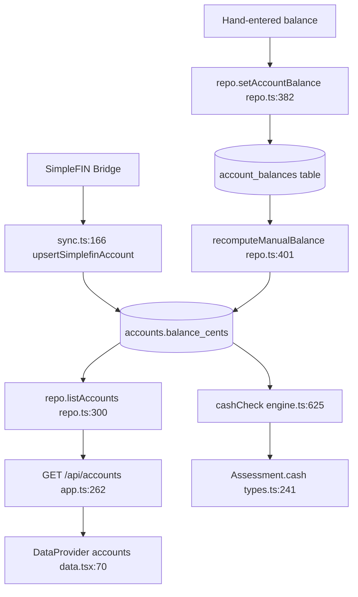

# Spec: Accounts at a glance (This period)

**Status:** proposed — not implemented.
**Request:** on the "This period" tab, below the total + summary block, add a compact section listing each account and its current balance.

---

## 1. Where the "This period" tab lives and how it renders

| What | Where |
|---|---|
| Nav entry `This period` | [`src/client/App.tsx:14`](../src/client/App.tsx#L14) |
| Default route → `PeriodView` | [`src/client/App.tsx:55`](../src/client/App.tsx#L55) |
| View component | [`src/client/views/PeriodView.tsx:12`](../src/client/views/PeriodView.tsx#L12) |

The "total + summary" block is the local `Hero` component, [`PeriodView.tsx:72-112`](../src/client/views/PeriodView.tsx#L72-L112):

- **Total** — `.hero-figure`, [`PeriodView.tsx:78`](../src/client/views/PeriodView.tsx#L78) (`money(Math.abs(t.leftoverCents))`).
- **Summary sentence** — `.hero-sub`, [`PeriodView.tsx:85-101`](../src/client/views/PeriodView.tsx#L85-L101).
- **Cash sentence** — `.cash`, [`PeriodView.tsx:102-109`](../src/client/views/PeriodView.tsx#L102-L109). Only renders when `a.cash != null`.

Render order in the view body, [`PeriodView.tsx:43-67`](../src/client/views/PeriodView.tsx#L43-L67):

```
43  <Hero a={a} />
44  <Ribbon a={a} />          <- day strip, part of the period header
46  {a.uncategorizedCount > 0 && ( ...banner... )}
59  <div className="cols section"> <Income/> <Expenses/> </div>
64  {a.reserves.length > 0 && <Reserves a={a} />}
66  <Unplanned ... />
```

### Insertion point

**Recommended: a new line 45, between `<Ribbon a={a} />` (line 44) and the uncategorized banner (line 46).**

```tsx
      <Hero a={a} />
      <Ribbon a={a} />
      <Accounts a={a} />        {/* new */}
```

Rationale: the ribbon is a day-navigation strip that belongs to the period header, so "below the total + summary" lands below it. This also keeps the new section above the uncategorized banner and the Income/Expenses columns, which is where an at-a-glance read belongs.

**Alternative** (if the section should sit directly under the cash sentence and above the ribbon): insert inside `Hero`, immediately after the closing `</p>` of the `.cash` block at [`PeriodView.tsx:109`](../src/client/views/PeriodView.tsx#L109) and before `</section>` at line 110. This couples the section to `Hero`'s `aria-live="polite"` region ([`PeriodView.tsx:76`](../src/client/views/PeriodView.tsx#L76)) — see §6 for why that is undesirable.

---

## 2. Where "current balance" actually comes from

### Short answer

`Account.balanceCents` is a **stored column**, not a derived value. There is no ledger-derived account balance anywhere in the codebase, so a synced-vs-derived disagreement is **not possible**. There *are* two plausible readings of "current balance" (`balanceCents` vs `availableCents`) — see below.

### The shape

[`src/shared/types.ts:68-85`](../src/shared/types.ts#L68-L85):

```ts
export interface Account {
  id: string;
  name: string;
  nickname: string | null;
  connName: string | null;
  currency: string;
  balanceCents: number | null;     // <- the value to show
  availableCents: number | null;   // <- the other reading
  balanceDate: number | null;      // unix seconds
  inBudget: boolean;
  manual: boolean;
  syncedThrough: number | null;
  lastError: string | null;
  ownerId: number | null;          // null = joint
}
```

### Provenance



Two writers, one column:

1. **SimpleFIN sync** — [`src/server/sync.ts:166-176`](../src/server/sync.ts#L166-L176) calls `repo.upsertSimplefinAccount`, which writes `balance_cents`, `available_cents`, and `balance_date` ([`src/server/repo.ts:322-328`](../src/server/repo.ts#L322-L328)).
2. **Hand-entered balance history** — `repo.setAccountBalance` ([`src/server/repo.ts:382-392`](../src/server/repo.ts#L382-L392)) upserts a row into `account_balances`, then `recomputeManualBalance` ([`src/server/repo.ts:401-409`](../src/server/repo.ts#L401-L409)) sets `accounts.balance_cents` to the **latest entry by date** and `balance_date` to that date at UTC midnight.

Read path: `repo.listAccounts()` ([`src/server/repo.ts:300-302`](../src/server/repo.ts#L300-L302)) → `GET /api/accounts` ([`src/server/app.ts:262`](../src/server/app.ts#L262)) → client context ([`src/client/data.tsx:70`](../src/client/data.tsx#L70)).

### Not derived from the ledger

`src/server/engine.ts` never computes an account balance from transactions. It only **reads** `balanceCents`, in `cashCheck` ([`src/server/engine.ts:625-627`](../src/server/engine.ts#L625-L627)):

```ts
const counted = accounts.filter((a) => a.inBudget && a.balanceCents != null);
const balance = sum(counted.map((a) => a.balanceCents!));
```

So: **one stored value, no reconciliation problem.**

### The two plausible readings — and the recommendation

| Reading | Field | Where it comes from | Currently rendered? |
|---|---|---|---|
| **A. Current / posted balance** | `balanceCents` | SimpleFIN `balance`, or latest hand-entered entry | Yes — [`SetupView.tsx:216`](../src/client/views/SetupView.tsx#L216), [`ReservesView.tsx:73`](../src/client/views/ReservesView.tsx#L73), and the Hero cash sentence via `cashCheck` |
| **B. Available balance** | `availableCents` | SimpleFIN `available-balance` ([`sync.ts:174`](../src/server/sync.ts#L174)) | **No.** Zero hits for `availableCents` in `src/client/**/*.tsx` |

**Recommendation: show `balanceCents` (Reading A).**

Why: the Hero cash sentence directly above the new section already reports `a.cash.balanceCents`, which is the sum of `balanceCents` over in-budget accounts ([`engine.ts:627`](../src/server/engine.ts#L627), rendered at [`PeriodView.tsx:104`](../src/client/views/PeriodView.tsx#L104)). Using `balanceCents` makes the list reconcile with the number above it. Using `availableCents` would produce a list that visibly fails to add up to the headline, with no explanation on screen.

If the user wants available balance too, add it as a **second, clearly-labelled column** rather than replacing the first — do not silently swap.

### Caveats

- `balanceCents` is `null` for accounts with no balance yet — notably the ad hoc `manual:cash` bucket ([`test/engine.test.ts:254`](../test/engine.test.ts#L254)). Render `–`, matching [`SetupView.tsx:216`](../src/client/views/SetupView.tsx#L216).
- **Lens inconsistency (important).** `applyLens` scales `balanceCents` by the person's share ([`src/server/engine.ts:863-874`](../src/server/engine.ts#L863-L874)), so the Hero cash sentence shows a *share* when a person is selected. But `/api/accounts` ([`app.ts:262`](../src/server/app.ts#L262)) returns raw `repo.listAccounts()` with **no lens applied**. A list built from `useApp().accounts` will therefore show full household balances while the sentence above it shows a share. See §3 and Open Question 1.

---

## 3. What data is already available client-side

**Everything needed is already loaded. No new endpoint is required.**

[`src/client/data.tsx:68-83`](../src/client/data.tsx#L68-L83) fetches accounts once at provider mount:

```ts
Promise.all([api.status(), api.items(), api.reserves(null), api.accounts()])
  .then(([s, i, r, a]) => { ...; setAccounts(a); })
```

- Context field: `accounts: Account[]` ([`data.tsx:17`](../src/client/data.tsx#L17)), populated at [`data.tsx:77`](../src/client/data.tsx#L77), exposed at [`data.tsx:103`](../src/client/data.tsx#L103).
- Hook: `const { accounts } = useApp()` ([`data.tsx:119`](../src/client/data.tsx#L119)).
- Refetch: `useData` re-runs on `version` and `personId` ([`data.tsx:142`](../src/client/data.tsx#L142)); `refresh()` bumps `version` ([`data.tsx:61`](../src/client/data.tsx#L61)). The provider's own effect also re-runs on `version` ([`data.tsx:83`](../src/client/data.tsx#L83)), so accounts stay fresh after a sync.

Each `Account` already carries `balanceCents`, `inBudget`, `nickname`, `name`, `ownerId`, `manual`, `lastError`, `balanceDate`.

### What the assessment payload does *not* carry

`Assessment` ([`src/shared/types.ts:229-245`](../src/shared/types.ts#L229-L245)) has no accounts array. It carries only the aggregate `cash: CashCheck | null` ([`types.ts:202-211`](../src/shared/types.ts#L202-L211)) with `balanceCents`, `accountCount`, and `asOf`.

### If lens-correct balances are wanted (Option B)

Minimal server change, **still no new endpoint**:

1. [`src/shared/types.ts`](../src/shared/types.ts) — add `accounts: Account[]` to `Assessment` (near line 241).
2. [`src/server/engine.ts`](../src/server/engine.ts) — populate it in `assessPeriod`'s return object, alongside `cash` at line 605, from `data.accounts` (already lens-scaled by `applyLens`).
3. [`src/client/views/PeriodView.tsx`](../src/client/views/PeriodView.tsx) — read `a.accounts` instead of `useApp().accounts`.

No new query, no new route, no repo change. `data.accounts` is already in memory on the server for every assessment request.

---

## 4. Component and styling patterns to reuse

### Primitives

| Primitive | Location | Use for |
|---|---|---|
| `Money` | [`src/client/components/ui.tsx:7-9`](../src/client/components/ui.tsx#L7-L9) | Every amount. Wraps `money()` and applies `.money` + `.neg`. |
| `table.lines` | [`styles.css:504-534`](../src/client/styles.css#L504-L534) | The app's universal list. Use this. |
| `table.lines .r` | [`styles.css:531-534`](../src/client/styles.css#L531-L534) | Right-align the balance column. |
| `tr.subhead` | [`styles.css:523-529`](../src/client/styles.css#L523-L529) | Optional group header row (e.g. "In the budget" / "Outside"). |
| `.section` + `header` + `h2` | [`styles.css:225`](../src/client/styles.css#L225), [`:1261`](../src/client/styles.css#L1261) | Section wrapper, matching `Income` ([`PeriodView.tsx:146-149`](../src/client/views/PeriodView.tsx#L146-L149)). |
| `.desc-sub` | [`styles.css:840-843`](../src/client/styles.css#L840-L843) | Secondary line under the account name (bank name, "Outside the budget", sync error). |
| `.name` + `Swatch` | [`styles.css:536`](../src/client/styles.css#L536), [`ui.tsx:30-32`](../src/client/components/ui.tsx#L30-L32) | Only if a colour dot is wanted; accounts have no colour field, so skip. |
| `.kv` | [`styles.css:1155-1169`](../src/client/styles.css#L1155-L1169) | A `<dl>` two-column grid — the closest existing "at a glance" stat block. Viable alternative to a table for a very short list. |
| `.totals-line` | [`styles.css:845-856`](../src/client/styles.css#L845-L856) | Flex row of small stats — candidate for a total row. |

**There is no generic card primitive.** `.reserve` ([`styles.css:915`](../src/client/styles.css#L915)) is reserve-specific. Do not invent a card; use `table.lines`.

### Existing account lists

| Location | What it is | Reusable? |
|---|---|---|
| [`SetupView.tsx:189-267`](../src/client/views/SetupView.tsx#L189-L267) | Full editable account table: name input, balance, owner `<select>`, in-budget checkbox | **No** — it is a form, not a read-only list. |
| [`ReservesView.tsx:54-80`](../src/client/views/ReservesView.tsx#L54-L80) | "Where reserve money sits": read-only account / bank balance / claimed / unclaimed table | **Closest analogue.** Copy its column shape and its `–` fallback for null balances ([`:73`](../src/client/views/ReservesView.tsx#L73)). |
| [`LedgerView.tsx:47-48`](../src/client/views/LedgerView.tsx#L47-L48), [`:116-120`](../src/client/views/LedgerView.tsx#L116-L120) | Account-name map + account filter `<select>` | No — not a list. |

**Recommendation: do not extract a shared component.** Write a small local `Accounts` function inside `PeriodView.tsx`, modelled on `Reserves` ([`PeriodView.tsx:287-340`](../src/client/views/PeriodView.tsx#L287-L340)). Extraction would touch three views to share roughly fifteen lines of JSX, and the three lists have different columns and different interactivity.

### Sketch

```tsx
function Accounts({ a }: { a: Assessment }) {
  const { accounts } = useApp();
  if (accounts.length === 0) return null;
  return (
    <section className="section">
      <header className="sec-head">
        <h2>Accounts</h2>
      </header>
      <table className="lines">
        <thead>
          <tr>
            <th scope="col">Account</th>
            <th scope="col" className="r">Balance</th>
          </tr>
        </thead>
        <tbody>
          {accounts.map((x) => (
            <tr key={x.id}>
              <td>
                {x.nickname || x.name}
                <div className="desc-sub">
                  {x.inBudget ? 'Counts toward the budget' : 'Outside the budget'}
                  {x.lastError ? ` · ${x.lastError}` : ''}
                </div>
              </td>
              <td className="r">
                {x.balanceCents == null ? '–' : <Money cents={x.balanceCents} />}
              </td>
            </tr>
          ))}
        </tbody>
      </table>
    </section>
  );
}
```

Note: `a` is unused in the sketch above unless a total row or `a.cash.asOf` is added — drop the prop if neither is wanted.

---

## 5. Formatting

**Helper: `money(cents, opts?)` at [`src/client/format.ts:12-17`](../src/client/format.ts#L12-L17).**

```ts
export function money(cents: number, opts: { sign?: boolean } = {}): string {
  const s = moneyFmt.format(Math.abs(cents) / 100);
  if (cents < 0) return `−${s}`;
  if (opts.sign && cents > 0) return `+${s}`;
  return s;
}
```

- Currency comes from `Intl.NumberFormat` with `style: 'currency'` ([`format.ts:4`](../src/client/format.ts#L4)); the code is set from server settings via `setCurrency` ([`format.ts:6-10`](../src/client/format.ts#L6-L10)), called at [`data.tsx:73`](../src/client/data.tsx#L73). Never hard-code a currency symbol.
- **Negatives:** absolute value is formatted and prefixed with U+2212 MINUS SIGN (`−`), not an ASCII hyphen. `-5000` → `−$50.00`. This is a real character, not a colour.
- Prefer the `<Money cents={...} />` component ([`ui.tsx:7`](../src/client/components/ui.tsx#L7)) over calling `money()` directly, for consistency with the rest of the app.
- `.money` gives `font-variant-numeric: tabular-nums` and `white-space: nowrap` ([`styles.css:116-120`](../src/client/styles.css#L116-L120)) — amounts will align in a column.

**Finding: `.neg` has no CSS rule.** A regex search for `neg` across [`src/client/styles.css`](../src/client/styles.css) returns **zero** matches. The `Money` component applies the class ([`ui.tsx:8`](../src/client/components/ui.tsx#L8)) but nothing styles it. So today, negative amounts are distinguished **only** by the `−` sign — never by colour. That is good for WCAG 1.4.1; do not assume a red style already exists, and if one is added, keep the sign.

---

## 6. Accessibility and i18n constraints

### i18n: there is no i18n system — do not invent one

All user-facing strings are hard-coded English JSX literals (e.g. `<h2>Coming in</h2>` at [`PeriodView.tsx:148`](../src/client/views/PeriodView.tsx#L148)). `Intl` is used **only** for number and date formatting ([`format.ts:4`](../src/client/format.ts#L4), [`format.ts:34`](../src/client/format.ts#L34)). There is no locale file, no `t()`, no translation layer.

**Action:** write plain English strings in the existing voice — sentence case, no trailing period on headings, curly apostrophes (`’`, as in [`PeriodView.tsx:34`](../src/client/views/PeriodView.tsx#L34)). Do not add an i18n abstraction as part of this change.

### Semantic HTML before ARIA

- `<section>` + `<header className="sec-head">` + `<h2>` — matches `Income` ([`PeriodView.tsx:146-149`](../src/client/views/PeriodView.tsx#L146-L149)).
- `<table className="lines">` with `<th scope="col">`. Existing tables in this app omit `scope` ([`PeriodView.tsx:156-158`](../src/client/views/PeriodView.tsx#L156-L158)); adding it is an improvement, not a deviation.
- No `role`, no `aria-label` on the table — the `<h2>` names the section.
- If rows become links, use `<a href>` inside a cell, not a click handler on `<tr>`.

### Contrast

Ratios below are computed from the token values at [`styles.css:10-27`](../src/client/styles.css#L10-L27) (light) and [`styles.css:45-66`](../src/client/styles.css#L45-L66) (dark).

| Pair | Light | Dark | Verdict |
|---|---|---|---|
| `--ink` `#1d3328` on `--paper` `#eef1e7` | high | high | Body text — safe |
| `--ink-2` `#4d6356` on `--paper` `#eef1e7` | **5.68:1** | **9.04:1** | Secondary text (`.desc-sub`, `th`) — passes 4.5:1 |
| `--ink-3` `#8a9a8e` on `--paper` `#eef1e7` | **2.59:1** | — | **Fails 4.5:1. Do not use for text.** |
| `--berry` `#a33b5c` on `--paper` `#eef1e7` | **5.51:1** | **6.83:1** | Negative emphasis — passes, if used |

**Constraint: use `--ink-2` for secondary text, never `--ink-3`.** (`--ink-3` is currently used for `tr.excluded` at [`styles.css:837`](../src/client/styles.css#L837) and as the `Swatch` fallback — out of scope here, but worth a separate ticket.)

### No information by colour alone (WCAG 1.4.1)

A negative balance already carries the `−` sign from [`format.ts:14`](../src/client/format.ts#L14). If berry colour is added for negatives, **keep the sign** — colour is the enhancement, not the signal. Likewise, "outside the budget" must be stated in text (as [`ReservesView.tsx:71`](../src/client/views/ReservesView.tsx#L71) does), not implied by dimming.

### Target size (WCAG 2.5.8, ≥24×24 CSS px)

- `table.lines td` padding is `0.55rem 0.5rem` ([`styles.css:518`](../src/client/styles.css#L518)) → row height ≈ 41 px. A full-row link is comfortably above 24 px.
- `.btn.small` padding is `0.25rem 0.55rem` ([`styles.css:292`](../src/client/styles.css#L292)) → ≈ 35 px tall. Fine.
- Do not add a bare icon button with less than 24×24 px.

### Motion (WCAG 2.3.3 / `prefers-reduced-motion`)

A global rule already disables all transitions under reduced motion ([`styles.css:1255-1259`](../src/client/styles.css#L1255-L1259)). **No per-component work is needed** as long as the new section adds no animation. Do not add an entrance animation or a collapsible with a height transition without gating it.

### Live regions

`Hero` already carries `aria-live="polite"` ([`PeriodView.tsx:76`](../src/client/views/PeriodView.tsx#L76)). The new section must **not** add another `aria-live` — stepping between periods would double-announce. This is a further reason to insert at line 45 (outside `Hero`) rather than inside it.

### Mobile

`table.lines` does not stack by default; only `table.stack` does ([`styles.css:1315-1345`](../src/client/styles.css#L1315-L1345)). A two-column account/balance table is narrow enough to survive 390 px without stacking — verify against the checklist at [`docs/HANDOFF.md:78-80`](HANDOFF.md#L78-L80) ("Nothing scrolls sideways except the Sankey").

---

## 7. Effort estimate

| Option | Scope | Files | Estimate |
|---|---|---|---|
| **A — client-only, household balances** | New `Accounts` component in `PeriodView.tsx`, inserted at line 45. Reads `useApp().accounts`. No server change, no new endpoint, no new query. | **1** file: [`src/client/views/PeriodView.tsx`](../src/client/views/PeriodView.tsx) | **~30–45 minutes** |
| **A+ — plus a total row** | Option A + a summed footer row + ~6 lines of CSS | 2 files (PeriodView, styles.css) | **~1 hour** |
| **B — lens-correct balances** | Option A + `accounts: Account[]` on `Assessment` + populate in `assessPeriod`. Still no new endpoint. | **3** files: [`src/shared/types.ts`](../src/shared/types.ts), [`src/server/engine.ts`](../src/server/engine.ts), [`src/client/views/PeriodView.tsx`](../src/client/views/PeriodView.tsx) | **~1.5 hours** |

**Uncertainty, stated explicitly:**

- I did **not** run the app, `npm run typecheck`, or `npm test`. These are read-only estimates from source inspection.
- The estimate assumes the demo seed produces at least two accounts with non-null balances ([`scripts/seed-demo.ts:80-87`](../scripts/seed-demo.ts#L80-L87) creates several and marks `demo:savings` out-of-budget, so this looks satisfied).
- Option B's estimate assumes no test updates are needed. `test/engine.test.ts` constructs `EngineData` by hand ([`test/engine.test.ts:75-80`](../test/engine.test.ts#L75-L80)); adding a required field to `Assessment` is a return-value change and should not break those, but this is unverified.
- If Open Question 8 (clickable rows) is taken, add ~15 minutes and one more file ([`src/client/views/LedgerView.tsx`](../src/client/views/LedgerView.tsx) needs no change — it already reads `account` from the query string at [`:25`](../src/client/views/LedgerView.tsx#L25)).

---

## 8. Open questions for the user

Each of these changes the shape of the work. Ranked by impact.

1. **Lens: household balances or the person's share?** When a person is selected under *Showing*, the Hero cash sentence shows their scaled share ([`engine.ts:863-874`](../src/server/engine.ts#L863-L874)) but `useApp().accounts` is unscaled ([`app.ts:262`](../src/server/app.ts#L262)). Showing full household balances next to a share-based headline is misleading. **This is the difference between Option A and Option B.** Options: (a) always household, and label the section "All accounts"; (b) lens-scaled via Option B; (c) household only, with a note that it is not share-adjusted.
2. **Net-worth total row?** Sum all listed accounts, or only in-budget ones? A total over all accounts is a net-worth figure the app does not currently surface anywhere; a total over in-budget accounts duplicates `a.cash.balanceCents` already in the Hero.
3. **Include out-of-budget accounts (`inBudget === false`)?** Show them dimmed with an "Outside the budget" note (as [`ReservesView.tsx:71`](../src/client/views/ReservesView.tsx#L71) does), or hide them entirely?
4. **Include accounts with `balanceCents == null`?** Notably `manual:cash` ("Cash & manual entries"), which never has a balance ([`test/engine.test.ts:254`](../test/engine.test.ts#L254)). Show as `–`, or omit?
5. **Show `availableCents` as a second column?** It is stored ([`repo.ts:64`](../src/server/repo.ts#L64)) but never rendered anywhere in the client today.
6. **Show an "as of" date?** `Account.balanceDate` ([`types.ts:77`](../src/shared/types.ts#L77)) and `CashCheck.asOf` ([`types.ts:210`](../src/shared/types.ts#L210)) are both unused in the client. A stale-balance warning would be genuinely useful but is scope growth.
7. **Collapsible?** A `<details>` wrapper is cheap and semantic, but adds a disclosure-control target-size and focus consideration.
8. **Clickable rows?** Navigating to the Ledger filtered to that account is nearly free — `LedgerView` already reads `account` from the query string ([`LedgerView.tsx:25`](../src/client/views/LedgerView.tsx#L25)), so `href('ledger', { account: x.id })` works today. Worth doing?
9. **Show on past and future periods too?** `a.cash` is `null` for non-current periods ([`engine.ts:605`](../src/server/engine.ts#L605)), so the Hero cash sentence disappears there. Account balances are not period-scoped, so the list *could* always show — but "current balance" next to a historical period may read oddly.
10. **Sort order?** Reuse the server's order — synced accounts first, then hand-entered, each by connection then name ([`repo.ts:301`](../src/server/repo.ts#L301)) — or sort by balance descending, or group in-budget first?

---

## Appendix: files read

`src/client/App.tsx`, `src/client/views/PeriodView.tsx`, `src/client/views/SetupView.tsx`, `src/client/views/ReservesView.tsx`, `src/client/views/LedgerView.tsx`, `src/client/data.tsx`, `src/client/api.ts`, `src/client/format.ts`, `src/client/components/ui.tsx`, `src/client/styles.css`, `src/shared/types.ts`, `src/server/app.ts`, `src/server/repo.ts`, `src/server/engine.ts`, `src/server/sync.ts`, `test/engine.test.ts`, `test/repo.test.ts`, `docs/HANDOFF.md`.
